# 🚀 lark-fashion-cockpit · 电商航母驾驶舱

> **一句话定位：** 给电商企业做**提效降耗的智能驾驶舱**——加速信息流转、让数据透明精准、把重复任务自动化、给老板智能决策辅助。33 个垂直业务 skill 串成一个"全员可用的本地系统"，任何员工跟它聊天就能用全部能力。

[](https://opensource.org/licenses/MIT)
[](https://github.com/larksuite/cli)
[](#-33-个-skill-清单痛点--解决方案--演示案例)
[](./examples/01-real-launch-demo.md)

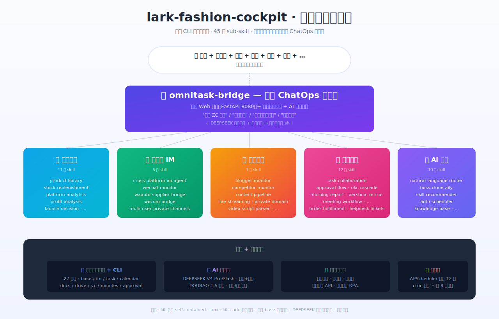

---

## 🤔 为什么做这个项目

### 电商老板真实痛点

> *"我每天要管上游（工厂、面料供应商）、下游（4 平台旗舰店 + 主播 + 客服）、私域（微信加客户）、公司日常管理（设计师/生产/内容/直播 8 角色）……每件事都琐碎，每件事都急，**最后我天天忙到半夜，公司还是赚不到钱**。"*

服装电商老板的真实困境：

| 表象 | 根因 |
|---|---|
| **很忙** | 信息散在 8 个工具切来切去 |
| **不赚钱** | 决策不精准（上烂款变库存、补货拍脑袋、营销发广告无差异）|
| **公司乱** | 数据不透明（谁干了什么、客户买了什么、库存还剩多少都对不上）|

根因不是"不会做款"，是 **数据散乱 + 决策没数据底座 + 重复工作没自动化**。

她需要一个**统一指挥台**，最好长这样：

> *"打开浏览器跟系统说话，它帮我把事情办了。"*


### 为什么飞书 CLI 是答案

飞书 CLI 已经把「base / im / task / calendar / docs / drive / vc / minutes / approval / okr / mail / contact / ……」全做成命令行能力了。问题是：

- ❌ 老板**不会写**命令行
- ❌ 员工**没法**直接用 CLI
- ❌ 多个 CLI 命令**怎么编排**？

答案：**用 AI 翻译"人话"成 CLI 调用 + 给一个统一的浏览器入口**。

---

## 📐 项目板块构成（一图读懂）

| 板块 | 干什么 | skill 数 |
|---|---|---|
| 🚀 **入口层** | 本地驾驶舱网页 + 常驻 AI 聊天浮窗 | 3 |
| 📊 **经营数据** | 产品/销售/库存/利润/客户画像/上新决策的飞书 base + AI 分析 | 11 |
| 📱 **跨平台 IM** | 把飞书、企业微信、个人微信串起来——一处发消息+一处收消息 | 2 |
| 🎬 **内容营销** | 博主监控+二创、竞品监控、内容流水线、直播复盘 | 4 |
| 🎯 **任务协作** | 任务/OKR/会议/早报/售后——团队协同枢纽 | 7 |
| 🤖 **AI 大脑 + 基础设施** | 自然语言路由、调度、第二大脑、词汇表、开源雷达、事件路由 | 6 |

**合计 33 个 self-contained sub-skill**，每个都能 `npx skills add` 单独安装。


---

## 📋 33 个 skill 清单（痛点 / 解决方案 / 演示案例）

每个 skill 用 **3 行小卡片** 展示：痛点是什么、怎么解决、典型用法举例。

> 标 ⭐ 是主推 skill。⭐ skill 还配了独立的效果演示图，往下翻看 [核心 skill 效果演示](#-核心-skill-效果演示)。

### 🚀 入口层（3 个）

#### ⭐ omnitask-bridge · 全员驾驶舱
- **痛点**：飞书 CLI 能力强但门槛高，老板和员工都不会用命令行；33 个后端 skill 是"散装能力"没有产品形态
- **解决**：本地 Web 驾驶舱（FastAPI 8080）+ 常驻聊天浮窗 + DEEPSEEK 自然语言路由，把所有 skill 包装成"任何人打开浏览器跟系统说话就能用"
- **演示**：老板浏览器聊天框输入 `今天销售如何？` → AI 路由到 query.sales_today → 拉飞书 02 表 → 浮窗回复"今日总销售 ¥45,820，淘宝 ¥21k 占 46%"

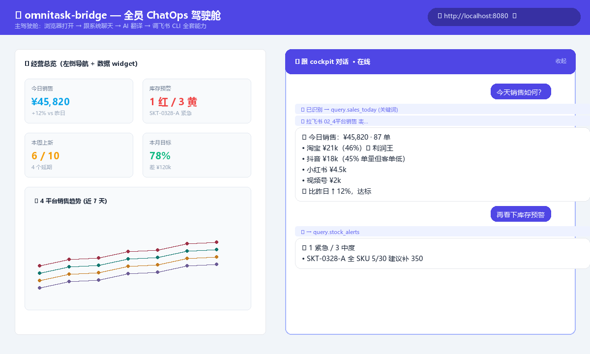

#### natural-language-router · 自然语言路由
- **痛点**：老板说"扫微信群"和"看下微信谁找我"是同一意思，关键词路由覆盖不全
- **解决**：DEEPSEEK V4 Flash 把模糊指令分类到 query/task/notify/content/doc/calendar/casual 七类，再路由到对应 skill
- **演示**：员工发 `帮我看一眼今天微信里的事儿` → AI 识别 = im.scan → 调收集器 → 5 秒后回卡片

#### multi-user-private-channels · 多角色权限
- **痛点**：不同角色（老板/设计师/生产/内容）应该有不同权限，不能员工冒用老板身份触发"通知供应商"
- **解决**：role-registry 角色权限矩阵，每个 skill 标注 scopes_required，调用前校验
- **演示**：设计师马萍蔓飞书发 `通知 ZC 工厂明天交货` → 校验 designer 没有 notify.supplier 权限 → 拒绝并提示"该指令仅老板可用"

---

### 📊 经营数据（11 个）

#### product-library · 产品库
- **痛点**：服装电商一个 SKU 涉及"颜色 × 尺码 × 款式 × 平台 × 生产 × 库存 × 销售 × 月度盘点"全维度属性，**真实业务里要 50 个字段才描述完整**——普通表格只能记 5-10 个，导致大量数据散落在 Excel / ERP / 平台后台拼不起来
- **解决**：飞书多维表格 **50 字段** 完整 schema，5 大功能区一表打尽：产品基础（12）+ 生产到仓（10）+ 库存占用（8）+ 销售统计（13）+ 月度货盘梳理（7）；含 5 个自动派生公式字段（售罄率/退货率/可售天数/实收金额/库存货值占比）
- **演示**：设计师在 01_产品库 录入新 SKU "连衣裙0501-FL" → 自动算售罄率 + 退货率 + 可售天数；老板娘问 `找出售罄率低于 50% 的产品` → cockpit 拉表 → DEEPSEEK 分析"3 个 SKU 命中"
- **完整字段全景**（基于真实服装电商运营梳理）：

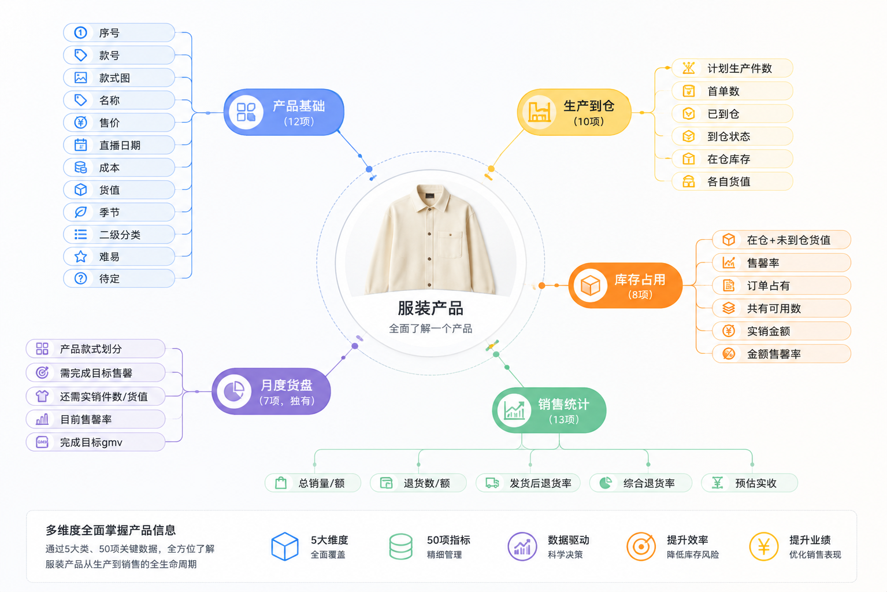

详细字段说明见 [`lib/base-schema/01_product-library-fields.md`](./lib/base-schema/01_product-library-fields.md)

#### ⭐ product-matching · 产品搭配引擎
- **痛点**：产品搭配靠拍脑袋；新品上线时不知道老款里哪些可以搭配卖
- **解决**：**底层逻辑——产品元素自动拆解**（颜色 / 衣长 / 材质 / 厚度 / 风格 / 价格区间 / 受众）→ 元素吻合度向量化匹配 → 输出"最佳搭配 Top 5" + 17_产品搭配组 表持久化
- **演示**：上新 连衣裙0501（春夏 / 法式 / 中长 / 雪纺 / 莓果红）→ 自动跑元素拆解 → 17 表新增"连衣裙0501 + 长裤0418 + 针织0402"3 个搭配组（吻合度 90 / 87 / 81，预计销售提升 +35%）

#### base-extension-product-matcher · 多维表 AI 搭配按钮
- **痛点**：在飞书多维表格里，需要一个"AI 一键搭配按钮"——选中产品行 → 弹出推荐搭配款，无需切换工具
- **解决**：飞书多维表格官方插件接口（addAction），把上面的 product-matching 算法变成一个表格按钮
- **演示**：在 01 产品库选中 连衣裙0501 → 点击行内"AI 搭配"按钮 → 弹层显示推荐 3 款搭配 + 一键写入 17 表

#### ⭐ stock-replenishment · 智能补货大脑
- **痛点**：补库存原来靠人**一个一个产品查库存 + 看搭配款 + 估销售期**，一周做一次累死，且经常错。商家库存数据**不在飞书里，在聚水潭 ERP** 里
- **解决**：同步聚水潭实时库存 → 多维度补货算法（**过往销售记录 + 产品最佳售卖期剩余 + 做货周期 + GMV 月度目标**）→ 每日生成补货建议报告
  - 决策维度：售卖期剩 1 个月但做货 25 天 → 不补
  - 售卖期剩 2 个月 + GMV 缺口大 → 强烈推荐补
  - 优先补搭配款主力 SKU（关联销售）
- **演示**：每日 9:00 自动跑 → 飞书报告："今日推荐补货 6 个 SKU，半身裙0328-A 紧急（库存 5/30，可售 28 天，做货 18 天，必须本周下单），针织0402 暂缓（剩可售期 25 天 < 做货周期 30 天）"

#### ⭐ platform-analytics · 多平台销售分析
- **痛点**：4 平台销售数据各自有报表，老板要拼半天才看清全局；销售目标定了之后没人盯，到月底才发现差距大
- **解决**：4 平台销售数据 → **渠道拆分**（直播 / 店铺 / 短视频 / 私域占比）+ **目标进度联动**（13_OKR 月度目标）→ AI 拼图"今日哪个平台贡献最多 + 距月度目标差多少 + 推荐主推哪些动作"
- **演示**：老板问 `今天哪个平台贡献最多` → "抖音 ¥18k 占 45%（直播 70% / 短视频 25% / 私域 5%），但客单价最低 ¥189。本月销售目标完成 78%，差 ¥120k，建议明天主推 连衣裙0501（毛利 32% 最高），渠道偏淘宝直播"

#### ⭐ profit-analysis · 真实利润分析
- **痛点**：销售额好不等于赚钱，光看销售忽略**平台扣点 + 推广头流 + 摊销人工税费 + 真实退货率**——老板心里没底，到月底才知道是亏是赚
- **解决**：完整利润算法
  - 单 SKU：售价 - 成本 - 平台手续费 - 头流投放 - 退货损失（按品类预估退货率）
  - 月度：每平台真实利润 + 月度浮动成本（报销 / 下单）+ 固定成本（人工 / 房租 / 税费）
  - 类目预估退货率（卖时间长的品牌能算出真实数）
- **演示**：老板问 `连衣裙0429 真实利润` → "客单价 299，扣 [成本 87 + 平台扣 8% + 头流 12 + 退货预估 6.5%] = **预估真实毛利 89 元 / 件，毛利率 29.8%**（行业平均 25% ✓）。本月该 SKU 累计预估利润 ¥38k"

#### ⭐ product-launch-prediction · 产品上新预测系统
- **痛点**：上一个新品 = 一次赌博。**上烂款 → 库存压死现金流；上爆款 → 带动整盘销售**。但老板没法事前知道哪些是爆款。设计师把 A/B/C 方案摆出来，凭感觉选，事后发现 D 才对
- **解决**：把每个新品**拆解为多维元素**（颜色 / 衣长 / 材质 / 厚度 / 风格 / 价格段 / 受众尺码） → 调用企业过往销售数据库 → 评估爆款可能性。综合维度还参考：
  - 当下销售周期（春夏中段 / 秋冬尾端）
  - 工厂翻单速度 + 品质合格率
  - 价格爆款度（同价位历史款销量）
  - 发货时间长短
  - 可搭配性（跟现有库存能否配套）
  - 对**用户画像库**的匹配度（现有客户喜不喜欢）
- **数据留存**：预测打分写入飞书 → 售卖周期结束后**自动对比真实销售** → 持续校准模型 → 越用越准
- **演示**：设计师上传"连衣裙0501"4 个色 → AI 评分"预测爆款度 87 / 100，主推莓果红 + 奶油白；预计首单 200 件 4 周售罄 75%；建议尺码做货 XS 16 / S 56 / M 76 / L 36 / XL 16"。3 个月后真实数据进来 → "实际售罄 78%（误差 3%）→ 模型在春夏法式品类上准确度高"

#### new-launch-planning · 上新波段企划
- **痛点**：一年 6 波上新（春夏 / 秋冬 / 节庆），节奏混乱，每次临时抓瞎；设计/打版/生产经常卡某个环节没人发现
- **解决**：智能化波段管理
  1. 04_上新波段 表预排全年节奏 + 自动倒推每个 SKU 的设计 / 打版 / 生产 deadline
  2. **波段合理性自动检测**（"5/15 上新但 4/30 还在打版" → 报警）
  3. **生产偏差自动触发供应链会议**（某 SKU 生产进度落后 3 天 → 自动建会议邀请生产+老板）
- **演示**：周五 17:00 系统自动跑 → "5/15 波段 10 个 SKU 进度异常 3 个：连衣裙0501 工艺确认延误（建议下周一开供应链会，已发会议邀请）/ 针织0402 面料未到（已飞书通知绍兴王哥）/ 长裤0418 等待打版（设计师未交稿）"

#### production-supplier · 生产供应商档案
- **痛点**：工厂任务靠微信群口头沟通，谁负责什么没记录，出问题甩锅
- **解决**：09_生产档案 表关联工厂 / 排期 / 进度 / 质量评分 + im-broadcaster 自动通知
- **演示**：系统看 09 表 → ZC 工厂 连衣裙0429 进度 80% / 还剩 2 天交期 → 自动飞书提醒 + 微信通知工厂"明天进展确认"

#### ⭐ customer-profile · 用户画像数据库
- **痛点**：客户散在 4 平台 + 私域微信，每平台一个 ID，**没法形成统一画像**。后果：上新拍脑袋（不知道现有客户身材分布）/ 营销无差异（高价值和沉睡一个待遇）/ 选品看大盘不看自己客户群偏好
- **解决**：多平台账号 ID 自动去重 + 聚水潭 ERP 拉历史订单 → 推测尺码/身高/体重/腰围/胸围/风格/购买频次 → **每个真实客户一份画像**。所有 cockpit 决策都查这个画像库
- **演示**：新客户加企微 → 提供淘宝 ID → 系统拉到 ¥3.2k 消费 / 12 次复购 / 偏好"法式约会风" / 多次买 M 码 → 自动打标"高价值-法式偏好-M 码"。后续 product-launch-prediction 评分会参考这份画像，stock-replenishment 做货按客户尺码占比分配

#### ⭐ private-domain · 私域客户匹配 + 自动化打标
- **痛点**：客户加了微信但没分层，全部当成一类发广告，转化低
- **解决**：基于 customer-profile 画像 → 客户活跃度/价值分级/风格偏好分群 → 不同分群发不同消息节奏 + 个性化话术
- **演示**：周五推春夏新品 → 高价值法式偏好客户收"VIP 老客限时 8 折 + 法式新品 5 款" / 普通客户收"全场 9 折通用券" / 沉睡客户收"召回礼包 + 顺丰包邮"

---

### 📱 跨平台 IM（2 个 — 简化设计）

跨平台 IM 只做两件事：**消息收集** 和 **消息发送**。

#### ⭐ im-broadcaster · 跨平台消息分发
- **痛点**：老板娘的合作伙伴散落在飞书 / 企业微信 / 个人微信，要发同一条消息（如"连衣裙0429 加急"）得切 3 个工具复制粘贴
- **解决**：在驾驶舱仪表盘对智能助手说一句话 + 指定哪个平台 → AI 理解后调用对应 API：
  - 飞书：lark-cli im
  - 企业微信：wecom API（48h 主动窗口 + 客户群发模板）
  - 个人微信：wxauto 控制 PC 微信（4 层风控：白名单 / 限速 / 仅 owner / 审计）
- **演示**：老板说 `通知 ZC 工厂 连衣裙0429 加急（微信）+ 同步通知朱健豪今晚出脚本（飞书）` → 一句话两端发出，回执"ZC 工厂浙江老张已读 ✓ / 朱健豪已读 ✓"

#### ⭐ im-collector · 跨平台消息汇集
- **痛点**：每天打开飞书 / 企微 / 个微 4 次切换看消息，重要的还容易漏；老板/员工**今天的沟通时间花在哪了根本不知道**，也没法看进展
- **解决**：三平台消息汇集 → DEEPSEEK 自动分析"今日沟通时间分布 + 重点事项进展" → 自动生成：
  1. **今日工作总结**（沟通主题 / 进展 / 卡点）
  2. **明日待办**（基于今日沟通推断）
  3. **AI 个性化建议**（基于经营情况，写飞书文档 / 飞书任务）
- **演示**：每晚 22:00 自动跑 → 老板飞书收到日报"今日沟通：ZC 工厂沟通 35 分钟（连衣裙0429 染色已解决）/ 朱健豪沟通 22 分钟（V2 脚本进展 80%）/ 客户 X 咨询 8 分钟。明日待办自动建 3 条任务。AI 建议：本周关键节点是 5/15 波段评审，建议今天先看下设计师方案"

---

### 🎬 内容营销（4 个）

#### ⭐ blogger-monitor · 对标博主+视频拆解
- **痛点**：对标博主每天发新视频但没人盯；想二创还要切换工具拉视频 + 拆脚本，工作流断裂
- **解决**：27_对标博主视频监控 表 + Deepseek 评分（女装关联度 / 学习价值 / 二创可行性）+ **同一 skill 内一键拆脚本**（yt-dlp + faster-whisper + DOUBAO 多模态 5 维度：镜头 / 台词 / 视觉 / 声音 / 节奏）
- **演示**：每天 9:00 自动跑 → 抖音 48 个对标博主新视频 → DEEPSEEK 评分 → 飞书卡片"今日 Top 3 爆款"——老板娘点 [拆脚本] 按钮 → 同 skill 内自动拆解 → 30 秒后飞书收到完整脚本 md

#### ⭐ competitor-monitor · 竞品监控雷达
- **痛点**：要**实时了解市场上竞争对手的产品情况**——他们上了什么新品、卖得怎么样、价格怎么定。但靠人工每天逛同行店铺看不过来
- **解决**：自动化竞品产品监控全流程
  1. 自动爬取竞品平台新品 + 销量数据
  2. 16_竞品产品监控 表持续更新
  3. AI 生成"竞品销售总结"（哪些款卖得好、定价策略）
  4. 自动推送相关角色：开发（影响新品决策）/ 老板（影响整体方向）
- **演示**：某竞品周一上 50 款春夏系列 → 系统抓到 → 周二早 9:00 飞书推送"⚠️ 莫千衣本周新品 50 款，4 款 7 天破百（建议参考），定价低于我们同款 30%（建议关注价格策略）" → @设计师 + @老板

#### content-pipeline · 内容流水线追踪
- **痛点**：选题→脚本→拍摄→剪辑→发布 5 步散在不同人手里，进度看不清
- **解决**：06_选题池 + 07_文案库 + 24_直播记录 表全链路追踪 + 卡点 alert
- **演示**：选题"连衣裙0429 春夏穿搭"建立 → 5 天没动 → 自动 nudge 朱健豪 + 飞书卡片"卡 5 天，催一下？"

#### ⭐ live-streaming · 直播复盘自动化
- **痛点**：**直播复盘耗精力**——每场要从 4 个工具拼数据 + 录屏自己看；而且复盘**靠感觉而不是数据支撑**，没法系统化迭代话术
- **解决**：建立科学的直播复盘算法 → 完整自动化流程
  1. 多平台数据自动爬取
  2. 直播录屏自动下载
  3. AI 拆话术：录屏转文字 + 按节奏分段 + 每段对应实时转化数据
  4. **AI 复盘报告**：基于数据 + 话术 + 转化算法 → 给出"哪段话术带 GMV、哪段拉低转化"的科学结论
  5. **下播即推送**：复盘自动到运营和主播飞书，让他们立马看 → 下场直播立即调整
- **演示**：昨晚 22:00 直播下播 → 22:15 主播飞书自动收到复盘卡："GMV ¥38k / 主推款 针织0402 转化 12%（高于均值）/ 投流 ROI 1.8（亏，下场降投）/ **话术 21:30-22:00 那段「面料对比演示」转化最高 8.2%，22:30 后讲价格效果差，下次试在高峰期讲价格**"

---

### 🎯 任务协作（7 个）

#### ⭐ task-collaboration · 跨租户任务协作
- **痛点**：飞书企业内的同事直接下任务很方便。但**很多合作方是个人飞书用户**（不在你的企业里），下任务、约日历、发消息都受跨租户限制
- **解决**：打通企业内成员 + 个人飞书外部联系人的协作通道——任务自动通知（绕过 P2P IM 限制）/ 日历自动邀请 / 关键事件主动通知
- **演示**：老板娘建任务给跨租户朋友彩虹（不在企业里）→ task +create + assignee → 朱朋友收到飞书任务通知（API 230038 不报错）+ 后续日程也能自动邀请

#### ⭐ task-lifecycle · 任务全生命周期
- **痛点**：管理者下任务后只能**被动等结果**或**主动催**，两个都累；会议结束没纪要决议无人跟进
- **解决**：完整追踪机制
  1. **下达**：系统强制完善任务信息（完成时间 / 完成标准 / 完成后做什么）
  2. **进行中**：AI 助手主动提醒接收方（"还有 X 时间没完成"）
  3. **复盘**：完成后自动让 ta 写复盘小结
  4. **沉淀**：复盘内容融进 knowledge-base 第二大脑
  5. **会议任务**：会议结束 → 妙记 AI 摘要 → 18_会议决策 表 → 决议自动转任务 → 跟进者每周复盘
- **演示**：周一例会决议"连衣裙0429 拍摄周三前完成" → 任务自动派给设计师 + 完成标准明确（6 张图 + 1 段视频）+ 周三 9:00 自动催 → 完成时让她填复盘 → 经验沉淀到 knowledge-base

#### ⭐ okr-cascade · OKR 级联追踪
- **痛点**：员工定了 OKR 但日常工作脱节——花了大量时间做的事**根本不在 OKR 完成路径上**，到月底领导才发现对不上。员工自己也搞不清自己的精力是否聚焦
- **解决**：员工定好 OKR 后写日报/周报 → **每条工作内容自动关联对应 KR 进度** → 给员工自己每日提醒（"今日 80% 时间花在 KR1，但 KR2 已 5 天没推进"）；给领导看周报时直接看到 OKR 关联度
- **演示**：朱健豪本周日报"完成 4 个任务" → 系统自动分析"3 个关联 KR1（内容产出）+ 1 个无关联（临时帮其他部门）" → 周报飞书报"本周 KR1 推进 +12% / KR2 (+0%) ⚠️ / KR3 (+5%) → 建议下周聚焦 KR2"

#### ⭐ morning-report · 跨渠道情报早报
- **痛点**：每天起床要打开 5 个工具看昨天发生了啥，浪费 30 分钟
- **解决**：早 8:00 自动跑：拉飞书 + 企微 + 个微 + 销售 + 库存 + 任务 → 一张早报卡片
- **演示**：老板娘起床打开飞书 → 一张早报卡："昨日销售 ¥45,820 ✓达标 / 库存 1 红 3 黄 / 你有 3 条 @消息 / ZC 工厂回复 连衣裙0429 可加急"

#### personal-mirror · 员工真实贡献镜像
- **痛点**：员工日报敷衍了事，老板分不清真假努力
- **解决**：22:00 自动拉员工飞书一天行为 → AI 4 维分析（任务推进/沟通密度/会议参与/重点产出）
- **演示**：每晚老板娘看朱健豪今日镜像 → "完成 4 个任务（含 1 个跨部门），开会 2 次（核心议程发言），主动推动 1 个跨问题"

#### ⭐ meeting-broadcaster · 个性化会议分发（合并 meeting-clip-extractor）
- **痛点**：高层中层开了一场会议，**信息要透传到一线员工要经过层层传达**——受时间 / 空间 / 表达力 / 人际关系影响，**信息透传必然损耗**
- **解决**：会议结束 → AI 智能助手分析 + 与 task-lifecycle 联动 → **给每个员工生成个性化会议报告**：
  1. 筛选"跟你岗位 / 部门 / 任务相关的内容"
  2. 解释这些任务"为什么这么做" + 跟 OKR 大目标的关系
  3. **会议高光片段提取**（核心价值观 / 重点决策 / 关键金句）放在每个员工的报告顶部
  4. 决议自动转任务 → 推到执行人飞书
- **演示**：周一例会结束 → 朱健豪收到："📌 高光 3 句金句 + 内容板块决议 + 你被分配 2 个任务 + 对应 OKR 私域 KR" / 申丽媛收到："📌 高光 + 生产板块决议 + ZC 工厂加急"

#### ⭐ helpdesk-customer-tickets · 多平台售后集合台（合并 order-fulfillment + feedback-returns）
- **痛点**：客户售后问题在微信 / 飞书 / 平台客服三个口同时进来；4 平台订单履约状态分散；退货反馈散在客服记录里同款问题反复没人发现
- **解决**：多平台售后**集中到一个统一入口**：
  1. 多平台售后问题集中到一个总后台（AI 自动汇集）
  2. 文字消息**统一回复入口**（无需切平台）
  3. 解决不了的复杂问题**一键跳转**对应平台后台
  4. 售后数据自动同步飞书 base 沉淀
  5. **退货监控自动化**：同款 ≥ 3 退货 / 退货率超阈值 → 自动 @生产 + @设计师，同时微信通知工厂
- **演示**：3 天内 针织0402 退货 5 单（"起球"）→ 自动飞书报警 + @申丽媛 + @马萍蔓 + 微信给 ZC 工厂浙江老张"针织0402 起球反馈 5 单，请下周面料检测"

---

### 🤖 AI 大脑 + 基础设施（6 个）

#### ⭐ boss-clone-aily · 老板分身
- **痛点**：**老板的时间是有限的**——每天大量时间用在沟通各部门，但**很多沟通是低效的**：员工汇报信息不全 / 简单问题反复问 / 同样问题不同人问 N 次
- **解决**：把老板"蒸馏"出来——通过 200-300 题语料 + 历史决策案例 + 风格语料训练分身
  - 员工有问题先问老板分身
  - 分身能直接解决的：直接解决（老板不被打扰）
  - 分身解决不了的：告诉员工"你汇报信息缺了什么" + "老板要的细节是什么" → 员工准备完之后再来找真老板
- **演示**：朱健豪问 `老板娘对大码怎么看` → 分身查 26 表过往 5 次决策都说"不做大码影响品牌定位" → 直接答（不打扰老板）；申丽媛问"我们仓库这个月新增哪个供应商" → 分身："这个我答不准，老板会先问你 1) 现有供应商哪不够 2) 你预算多少 3) 交期要求多久 — 准备好再来找她"

#### auto-scheduler · 定时任务调度器
- **痛点**：12 个定时任务（早报 / 库存扫 / 博主抓 等）散在不同 cron / 手动起，状态看不清
- **解决**：APScheduler 主调度器 + config/auto-triggers.json 集中管理 + 状态可视化
- **演示**：老板娘 `定时任务状态` → "12 个任务全 OK，下次跑：早报 8:00 / 库存扫 30 分钟后 / 博主抓 9:00"

#### ⭐ knowledge-base · 公司第二大脑
- **痛点**：每天公司里发生很多事——**成功经验 / 失败教训 / 员工建议**——都散在群聊和会议里，没沉淀，新员工查询要问 5 个人
- **解决**：第二大脑进化机制
  1. 员工通过日报 / 周报 / 月报提交工作总结（含成功 / 失败 / 建议）
  2. 老板或部门主管**审批选择性抓取**——把"值得沉淀"的成功 / 失败经验勾选纳入知识库
  3. 19_经验沉淀库 + 飞书 wiki 联动 + 向量检索
  4. 员工查询时自动命中
- **演示**：朱健豪本周日报"连衣裙0429 直播在 22:00 后讲价格转化下降" → 老板审批通过纳入知识库（标签：直播 / 话术节奏）→ 下次新主播培训自动检索到"22:00 后避免价格话术"

#### lingo-fashion-glossary · 服装行业词典
- **痛点**：服装行业黑话（"色号 / 版型 / 安全线 / 上新波段"）跨部门理解不一致
- **解决**：飞书 lingo 服装词汇表
- **演示**：跨租户朋友看到"安全线" → 鼠标悬停 → 飞书 lingo 弹窗 → "库存预警最低限，<此值即触发补货"

#### opensource-radar · 开源生态雷达
- **痛点**：AI 工具天天有新项目，但管理者没时间逐个评估哪些适合女装电商
- **解决**：每日 GitHub trending 抓取 + DeepSeek 评估"女装电商相关性" + 自动汇报给运营 / 技术 / 老板
- **演示**：每天 12:00 抓 GitHub → DEEPSEEK 评分 → 飞书"今日推荐 3 个：① wxauto4（微信桌面自动化）② DOUBAO-Vision（多模态）③ FlashRAG（向量检索 → 适合 knowledge-base）"

#### event-router · 飞书事件路由器
- **痛点**：飞书事件回调（消息 / 群变更 / 反应）多种类型，每个 skill 都自己处理太重
- **解决**：统一事件路由层 + 按类型分发到对应 skill
- **演示**：用户给老板娘卡片点赞 → event-router 路由到 reaction-handler → 自动记录情感反馈到 26 表

---

## 🖼 核心 skill 效果演示

下面 9 张图是核心 skill 的效果演示（聊天对话 + 飞书卡片回执 + 实际数据），让你不用跑环境就能看清每个 skill 实际长什么样：

### omnitask-bridge · 全员驾驶舱


### im-collector · 跨平台消息汇集（继承自 wechat-monitor 演示）
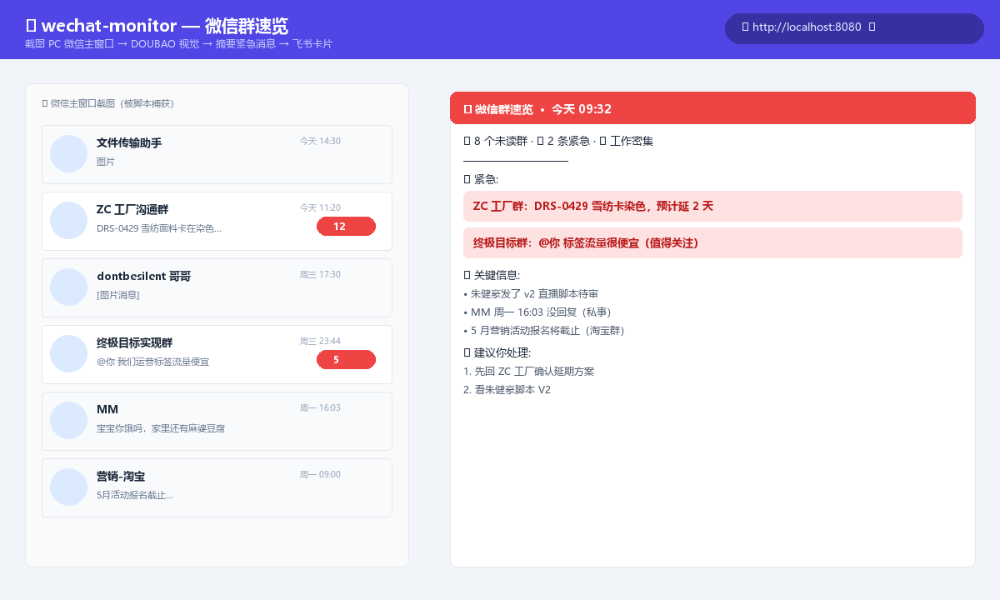

### morning-report · 早 8:00 跨渠道情报早报
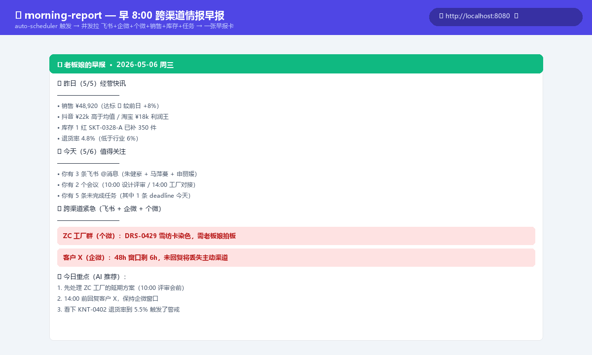

### product-library · 服装电商产品库 + AI 分析
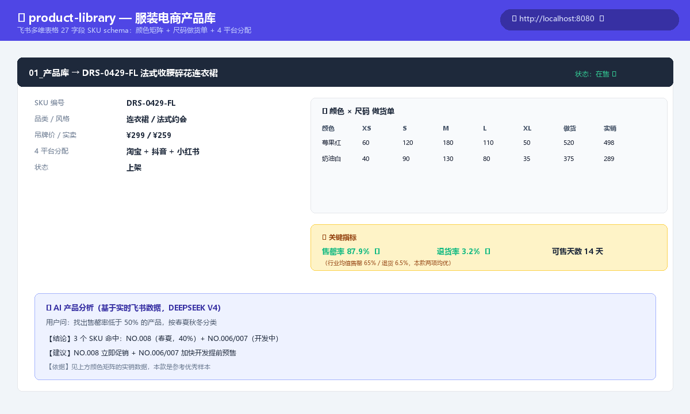

### blogger-monitor · 对标博主监控（含二创）
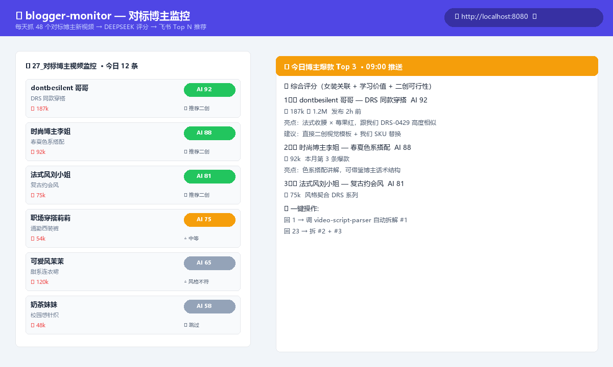

### im-broadcaster · 飞书指令通知供应商（继承自 wxauto-supplier-bridge 演示）
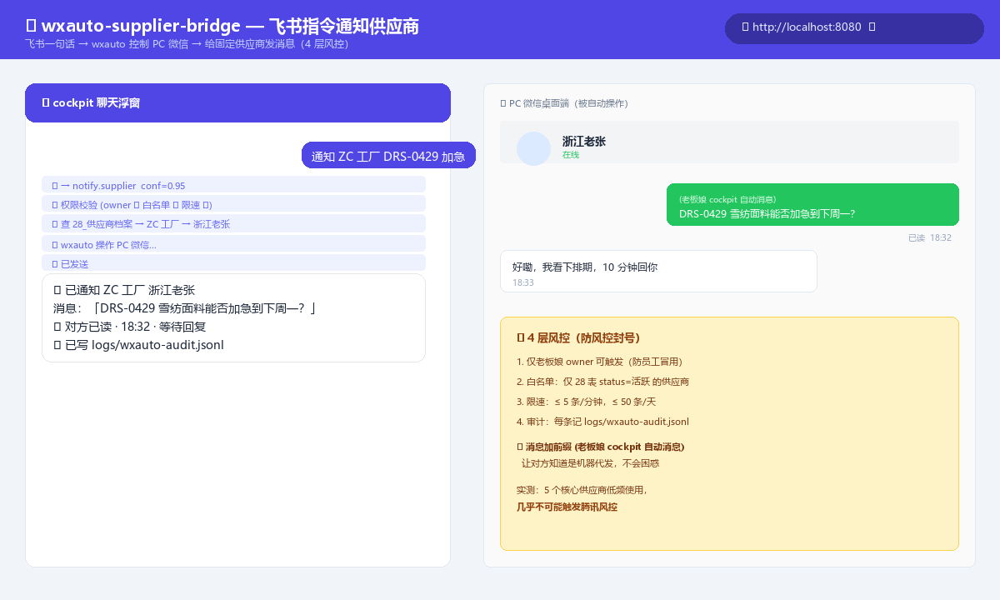

### stock-replenishment · 库存预警自动报警
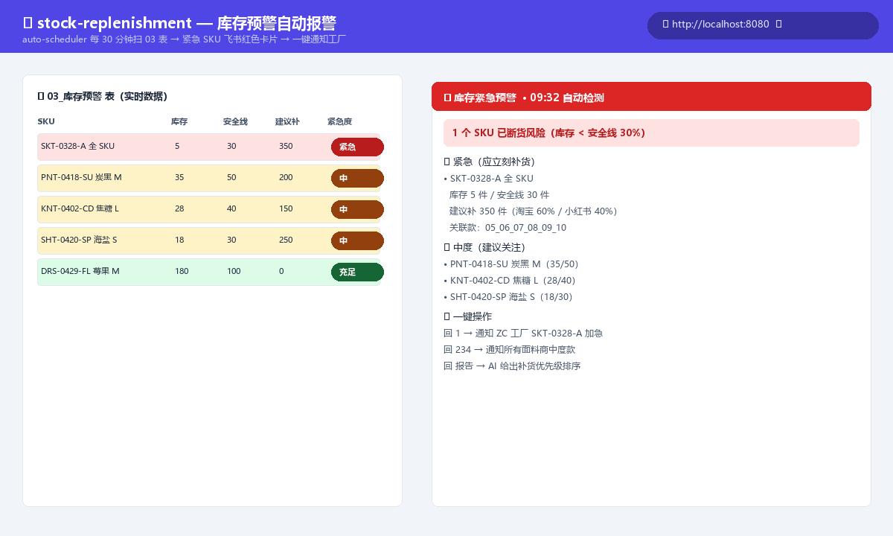

### launch-decision · AI 上新方案评分
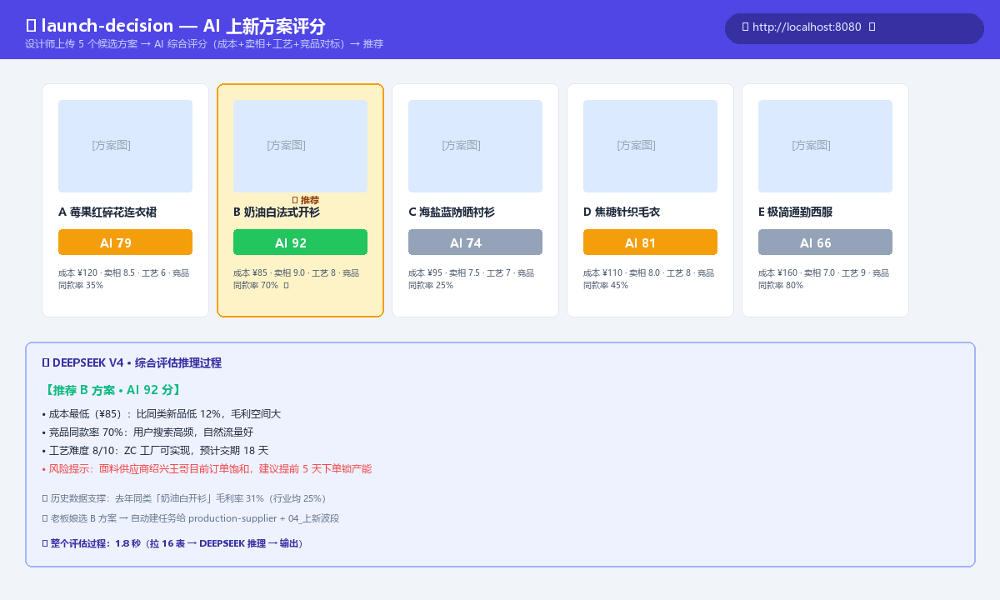

### personal-mirror · 员工今日真实贡献镜像
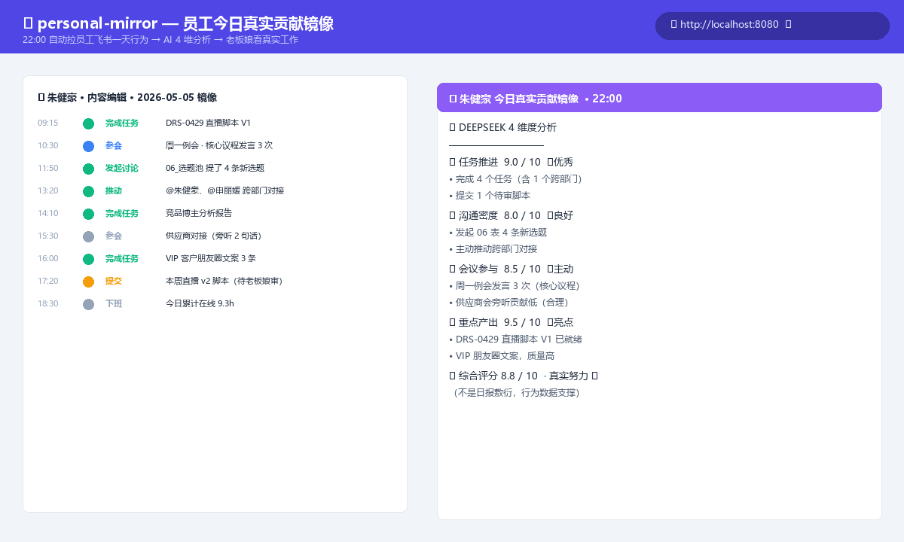

---

## 🎯 核心场景演示

### 场景 1：早 8:00 自动跨渠道情报早报

```
auto-scheduler 每天早 8:00 触发 morning-report
  ↓
并发拉：
  ├─ 飞书：昨日团队群 @我 + 待办（lark-im + lark-task）
  ├─ 企微：昨日核心客户消息（im-collector → 企微 API）
  └─ 个微：扫主窗口红点（im-collector → 飞书滚动截屏 + DOUBAO）
  ↓
DEEPSEEK 三路情报合并 → 一张早报卡片到老板娘飞书
  ↓
"昨晚 ZC 工厂群 @你说 连衣裙0429 雪纺面料卡了，朱健豪发了脚本 V2 待审..."
```

### 场景 2：跟驾驶舱说人话办事

```
老板娘在浏览器聊天框输入：
"通知 ZC 工厂 连衣裙0429 雪纺面料下周一前能不能交货"

→ DEEPSEEK 识别 im-broadcaster，提取 supplier="ZC 工厂"
→ 路由到对应渠道（个微 / 企微）
→ 自动给 ZC 工厂发消息（含审计 log）
→ 飞书卡片："✓ 已发给 ZC 工厂浙江老张，对方已读"
```

### 场景 3：基于实时飞书数据的 AI 分析

```
聊天窗口："找出售罄率低于 50% 的产品，按春夏秋冬分类"

→ 路由到 query.product_analysis
→ lark-cli 拉 01_产品库 实时数据（80 条）
→ DEEPSEEK 分析

返回：
【结论】共 3 个 SKU 售罄率 < 50%：NO.008（春夏，40%）+ NO.006/007（开发中）
【建议】NO.008 立即促销 / NO.006/007 加快开发预售 / 春夏 NO.001/004 控制补货
```

---

## 📦 安装与启动

### 快速开始

```bash
# 1. 装 lark-cli 主程序
npm install -g @larksuite/cli

# 2. 装本仓库 35 个 sub-skill（一次性）
npx skills add fxl1209739475-fxl/lark-fashion-cockpit -g -y

# 3. 配置环境变量
git clone https://github.com/fxl1209739475-fxl/lark-fashion-cockpit
cd lark-fashion-cockpit
cp .env.example .env
# 然后填 DOUBAO_API_KEY / DEEPSEEK_API_KEY / 飞书 base token / 等

# 4. 一键初始化飞书 base（建 27 张表 schema + 字段 + mock 演示数据）
python scripts/init-cockpit.py

# 5. 启动驾驶舱（本地 Web 系统 + 聊天浮窗）
./start-omnitask.bat
# 浏览器访问 http://localhost:8080
```

> ⚠️ **装 skill ≠ 自动建表**。skill 是后端处理逻辑，飞书 base 数据需要 step 4 单独初始化。

---

## 📂 关键架构文件

```
lark-fashion-cockpit/
  ├─ skills/                            # 35 个 sub-skill 自包含
  │   ├─ omnitask-bridge/               # ⭐ 入口：驾驶舱 + 聊天 + AI 路由
  │   │   ├─ web/                       # 前端（FastAPI serve）
  │   │   ├─ scripts/                   # server / chat_router / skill_executor / feishu_data
  │   │   └─ config/skills-registry.json
  │   ├─ im-collector/ · im-broadcaster/  # 跨平台 IM 收发两件套
  │   ├─ blogger-monitor/               # 含 video-script-parser
  │   ├─ task-lifecycle/                # 含 meeting-workflow
  │   ├─ helpdesk-customer-tickets/     # 含 order-fulfillment
  │   ├─ platform-analytics/            # 含 target-tracking
  │   ├─ product-matching/              # 含 product-graph
  │   └─ ... (其他 skill)
  ├─ scripts/
  │   ├─ event-listener.py              # 飞书 IM 消息监听 + 路由分发
  │   └─ init-cockpit.py                # 一键建 27 张表 + mock 数据
  ├─ docs/images/architecture.svg       # 本 README 的架构图
  ├─ start-omnitask.bat                 # 一键启动驾驶舱
  └─ .env.example                       # 环境变量模板
```

---

## 🔑 必备的环境变量

参考 `.env.example`：

```bash
# AI 模型
DOUBAO_API_KEY=ark-xxxxx          # 火山方舟，视觉模型用
DEEPSEEK_API_KEY=sk-xxxxx         # DEEPSEEK，路由+总结用
DEEPSEEK_MODEL=deepseek-chat

# 飞书 base
LARK_FASHION_COCKPIT_BASE_TOKEN=...
LARK_FASHION_COCKPIT_BOSS_CHAT=oc_...
LARK_FASHION_COCKPIT_BOSS_OPEN_ID=ou_...

# 飞书表 ID（init-cockpit.py 自动建表后填）
TABLE_PRODUCT_LIBRARY=tblxxxxx
... (共 27 张)

# 抖音爬虫
DOUYIN_COOKIE=...

# 聚水潭（库存补货 skill 需要）
JUSHUITAN_APP_KEY=...
JUSHUITAN_APP_SECRET=...
```

---

## 🎬 5 分钟跑通的演示路径

1. 装好依赖（参考"安装与启动"）
2. 启动 `./start-omnitask.bat` → 浏览器打开 http://localhost:8080
3. 看到女装驾驶舱 + 右下角 💬 浮窗
4. 点 💬 浮窗，依次发送：
   - `今天销售` → 自动拉飞书销售表（含目标进度）
   - `库存预警` → 自动列出红色 SKU + 补货建议
   - `今天会议` → 自动列今日日程
   - `找出售罄率低于50%的产品` → 拉产品库 + AI 结构化分析
   - `让设计师汇报本周进度` → 自动建任务 + 指派给马萍蔓
5. 每条指令的执行进度会实时流式显示在浮窗里

---

## 🤝 数据隐私声明

- 所有飞书 base 数据**保留在你自己的飞书租户**，不上传第三方
- AI 调用走 DEEPSEEK / DOUBAO 官方 API，不缓存对话内容
- 个人微信桥（im-collector / im-broadcaster）所有截图**用完即丢不写盘**
- 企业微信桥走腾讯官方合规 API
- 审计日志统一记 `logs/`，仅本地可见

---

## 🆘 反馈 / 报问题

GitHub issues：https://github.com/fxl1209739475-fxl/lark-fashion-cockpit/issues

---

## 📜 License

MIT License — 自由商用 / 改造 / 分发。
