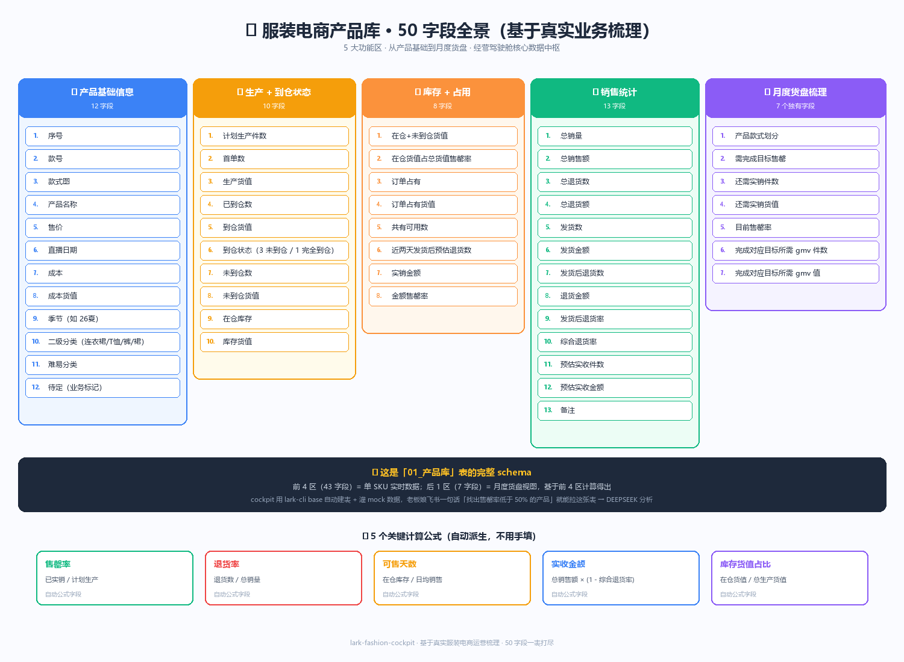

# 01_产品库 · 50 字段完整 schema

> 基于真实服装电商运营场景梳理，是 cockpit 整套系统的**核心数据中枢**。
>
> 老板娘要问的所有产品/销售/库存/利润相关问题，最终都会回到这张表。



---

## 🔵 区 1：产品基础信息（12 字段）

| # | 字段名 | 类型 | 示例 | 说明 |
|---|---|---|---|---|
| 1 | 序号 | auto_number | 1 | 自动编号 |
| 2 | 款号 | text | TG03P202001 | 内部款号（首字 T = 头部款 / 中间数字 = 月份）|
| 3 | 款式图 | attachment | 鞋子缩略图 | 设计师上传产品图 |
| 4 | 产品名称 | text | "老钱风简约麂皮乐福鞋" | 中文长名（用于直播口播）|
| 5 | 售价 | currency | ¥898 | 实卖价（不含活动折扣）|
| 6 | 直播日期 | date | 2026/04/25 | 计划首播日期 |
| 7 | 成本 | currency | ¥185 | 单件成本（面料 + 工艺 + 辅料）|
| 8 | 成本货值 | currency | ¥37,000 | 成本 × 计划生产件数 |
| 9 | 季节 | select | 26夏 / 26秋冬 | 用于上新波段排期 |
| 10 | 二级分类 | select | 半身裙 / 毛针织衫 / 休闲裤 / 牛仔裤 / 衬衫 / T恤打底衫 / 连衣裙 | 平台报送类目 |
| 11 | 难易分类 | select | 简单 / 中 / 高难度 | 影响生产排期 |
| 12 | 待定 | text | （业务标记字段）| 临时标识，便于人工筛选 |

## 🟡 区 2：生产 + 到仓状态（10 字段）

| # | 字段名 | 类型 | 示例 | 说明 |
|---|---|---|---|---|
| 13 | 计划生产件数 | number | 200 | 首单计划下多少件 |
| 14 | 首单数 | number | 200 | = 计划生产件数（双字段方便补单数据进来）|
| 15 | 生产货值 | currency | ¥37,000 | = 成本 × 计划生产件数 |
| 16 | 已到仓数 | number | 212 | 工厂已交货件数 |
| 17 | 到仓货值 | currency | ¥39,220 | = 成本 × 已到仓数 |
| 18 | 到仓状态 | select | 1完全到仓 / 2部分到仓 / 3未到仓 | 自动着色（绿/黄/红）|
| 19 | 未到仓数 | formula | = 计划 - 已到仓 | 自动算 |
| 20 | 未到仓货值 | formula | = 未到仓数 × 成本 | 自动算 |
| 21 | 在仓库存 | number | 100 | 仓库实物（未销售）|
| 22 | 库存货值 | formula | = 在仓库存 × 成本 | 自动算 |

## 🟠 区 3：库存 + 占用（8 字段）

| # | 字段名 | 类型 | 示例 | 说明 |
|---|---|---|---|---|
| 23 | 在仓+未到仓货值 | formula | ¥48,500 | 总货值（含未到的）|
| 24 | 在仓货值占总货值售罄率 | formula | 35% | 反映库存周转健康度 |
| 25 | 订单占有 | number | 75 | 已下单未发货占用件数 |
| 26 | 订单占有货值 | formula | ¥13,875 | = 订单占有 × 成本 |
| 27 | 共有可用数 | formula | = 在仓 - 订单占有 | 真实可售件数 |
| 28 | 近两天发货后预估退货数 | formula | 18 | = 近 2 天发货数 × 历史退货率 |
| 29 | 实销金额 | currency | ¥21,300 | 真实成交金额（去除取消）|
| 30 | 金额售罄率 | formula | 28% | = 实销金额 / 计划总销售额 |

## 🟢 区 4：销售统计（13 字段）

| # | 字段名 | 类型 | 示例 | 说明 |
|---|---|---|---|---|
| 31 | 总销量 | number | 187 | 含退货前总单 |
| 32 | 总销售额 | currency | ¥55,963 | 含退货前总额 |
| 33 | 总退货数 | number | 12 | 累计退货 |
| 34 | 总退货额 | currency | ¥3,592 | 累计退货金额 |
| 35 | 发货数 | number | 175 | 实际已发件数 |
| 36 | 发货金额 | currency | ¥52,371 | 实际已发金额 |
| 37 | 发货后退货数 | number | 8 | 发货后才退的（影响仓储）|
| 38 | 退货金额 | currency | ¥2,394 | = 发货后退货 × 客单价 |
| 39 | 发货后退货率 | formula | 4.6% | = 发货后退货数 / 发货数 |
| 40 | 综合退货率 | formula | 6.4% | = 总退货数 / 总销量 |
| 41 | 预估实收件数 | formula | 175 - 退货预估 | 7 天内预估真实成交 |
| 42 | 预估实收金额 | formula | ¥49,500 | = 总销售额 × (1 - 综合退货率) |
| 43 | 备注 | long_text | "面料反馈起球" | 客服整理的退货关键词 |

## 🟣 区 5：月度货盘梳理（7 个独有字段）

> 月度货盘是基于前 4 区数据的**月度快照视图** — 老板娘月初对账用，重复字段不重新建。

| # | 字段名 | 类型 | 示例 | 说明 |
|---|---|---|---|---|
| 44 | 产品款式划分 | select | A级款 / B级款 / 测款 / 清仓 | 月初老板娘人工或 AI 打标 |
| 45 | 需完成目标售罄 | number | 80% | 月度售罄目标 |
| 46 | 还需实销件数 | formula | = 计划 × 目标售罄 - 已实销 | 月内还要卖多少 |
| 47 | 还需实销货值 | formula | ¥35,000 | 上述 × 客单价 |
| 48 | 目前售罄率 | formula | 65% | 当下进度 |
| 49 | 完成对应目标所需 gmv 件数 | formula | 24 | 距月度 GMV 目标差几件 |
| 50 | 完成对应目标所需 gmv 值 | formula | ¥7,200 | 距月度 GMV 目标差金额 |

---

## 🧮 5 个自动派生公式字段

| 字段 | 公式 | 用途 |
|---|---|---|
| 售罄率 | 已实销 / 计划生产 | 反映周转健康（< 50% = 滞销预警）|
| 退货率 | 退货数 / 总销量 | 反映品质口碑（> 8% = 质量预警）|
| 可售天数 | 在仓库存 / 日均销售 | 库存还能卖多久（< 14 天 = 紧急补货）|
| 实收金额 | 总销售额 × (1 - 综合退货率) | 真实利润基础 |
| 库存货值占比 | 在仓货值 / 总生产货值 | 库存压货风险 |

---

## 📊 这张表如何驱动整个 cockpit

1. **stock-replenishment（智能补货大脑）** 拉这张表 + 销售记录 + 做货周期 → 算每日补货建议
2. **profit-analysis（真实利润分析）** 拉这张表 + 平台扣点 + 头流投放 → 算每 SKU 真实利润
3. **launch-decision（上新方案评分）** 拉这张表的"二级分类 / 季节"做对标历史数据
4. **product-matching（产品搭配引擎）** 拉这张表的"二级分类 / 季节 / 风格"做元素拆解
5. **morning-report（跨渠道情报早报）** 早 8:00 拉本表关键预警 SKU + 销售榜进早报
6. **omnitask-bridge（全员驾驶舱）** 老板娘自然语言查"DRS-0429 利润 / 售罄率 / 库存"全部回到这张表

**一表 50 字段 = 整个 cockpit 数据底座**。

---

## 🚀 一键建表

```bash
python scripts/init-cockpit.py --table 01_product-library
# 自动建表 + 加全部 50 字段 + 灌 8 条 mock 演示数据
```

参考 `lib/base-schema/fields/01_product-library/` 下的 JSON schema 文件。
